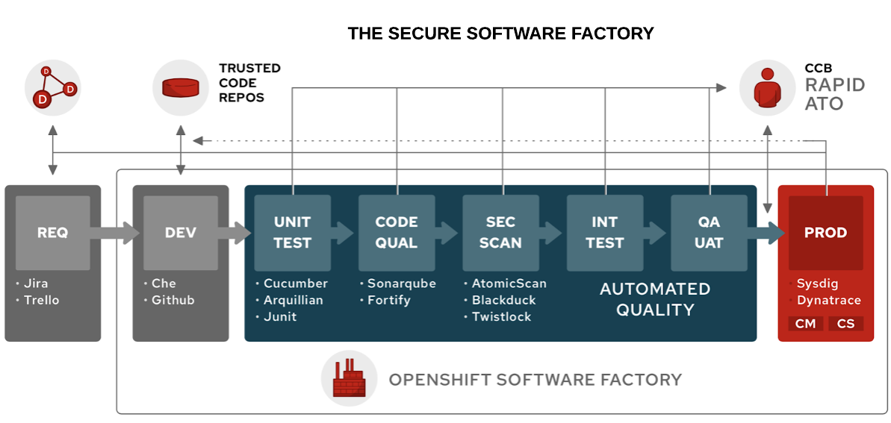

The notion of Secure Software Factory is that of applying an assembly line approach to software that includes building increasing levels of assurance before marking an artifact as ready to deploy to production.

In this workshop, you will use build orchestration tools such as Tekton, Kubernetes, and OpenShift to support implementing and integrating [continuous delivery (CD)][1] as the foundation of automating the various stages of the deployment lifecycle are represented – from development, multiple types of testing, user acceptance, staging, to production release.

For many organizations, obtaining Authority to Operate (ATO) is an arduous process requiring hundreds of pages of documentation, and can prevent organizations from adopting continuous delivery practices for fear of falling out of compliance. Each phase in our Secure Software Factory will have a policy defining the stage gate for success and will generate a documentation artifact that will later be used as part of the [ATO process][2].

Having a secure foundation for your applications is a key component to a Secure Software Factory. In the following lab exercises, your applications will inherit these security controls from the accredited OpenShift platform.

The approach towards the Authorization and Accreditation (A&A) process with OpenShift follows a Landlord/Tenant model. OpenShift is a container application platform that provides a standardized operating environment and when assessing system boundaries, a delineation should be made between the OpenShift system itself, which operates as a Landlord, and the tenant application, which consumes the OpenShift service.

In Landlord/Tenant system security plans (SSP), many security controls are inherited from the Landlord’s SSP, but some controls remain the responsibility of the OpenShift consumers. Following this division of responsibilities illustrated in the diagram above, some controls would be considered the responsibility of the tenant, whereas a good number of controls are already taken care of by the Landlord.

This is similar to how networking or underlying storage infrastructure is accredited in a virtualized environment, then inherited by virtual machines. A Secure Software Factory simply moves this delineation between Landlord and Teneant higher up the stack.

[1]: https://en.wikipedia.org/wiki/Continuous_delivery
[2]: https://cloud.gov/docs/compliance/ato-process/
