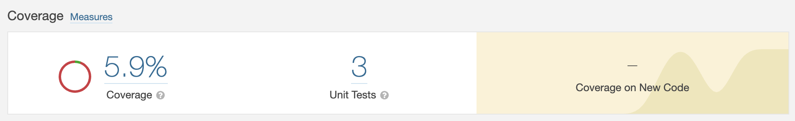
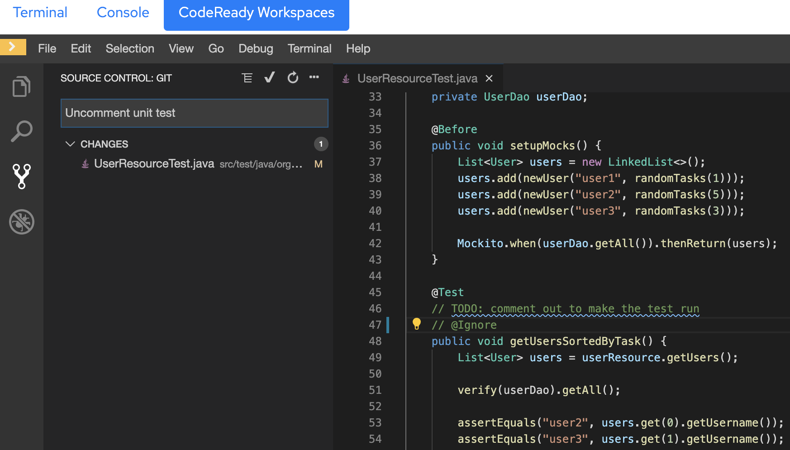
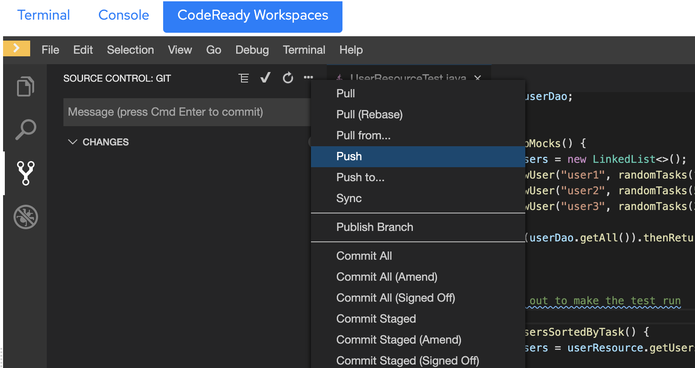
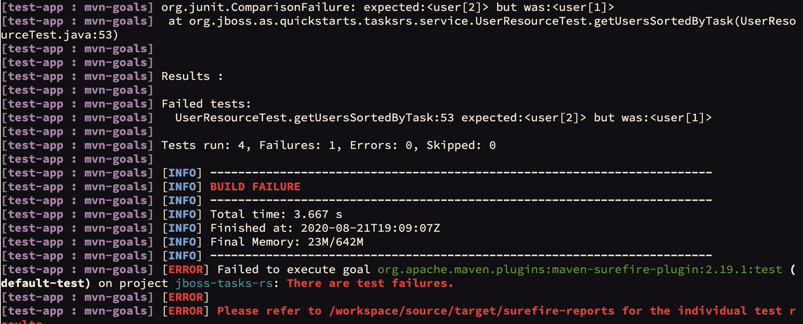
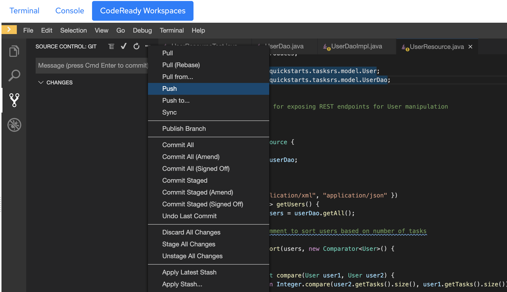
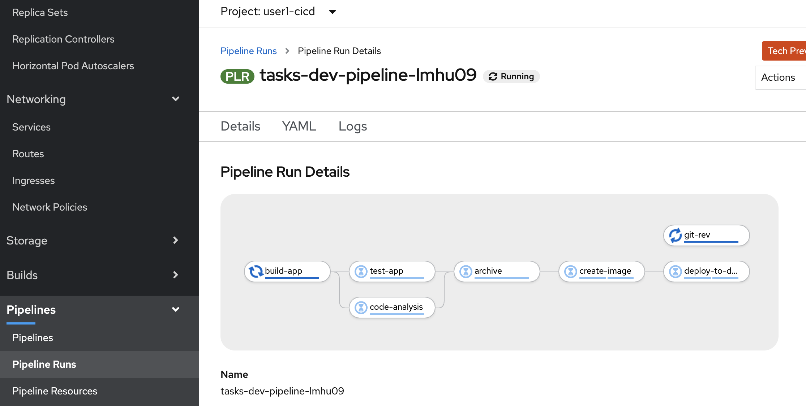
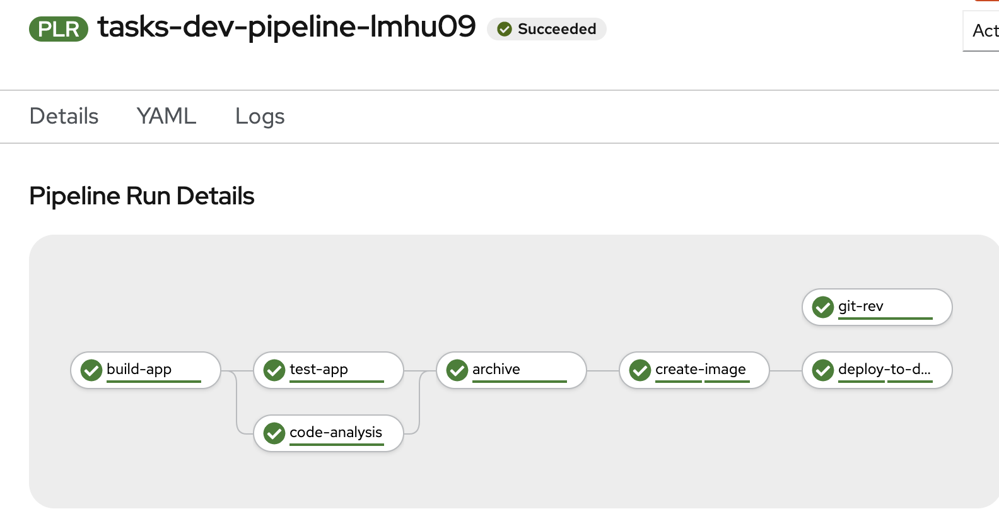
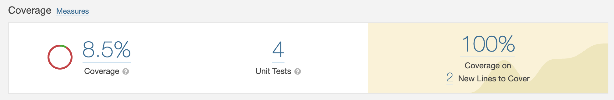

# Triggering the Trusted Software Supply Chain
Now that our triggers are in place, let's test out the supply chain by performing a little application development.

If you had a chance to check Sonarqube for the results of the static code analysis scan, you may have noticed that our **code coverage**, which is to say: *the percentage of code which is executed during unit testing*, comes in at a not-so-hot **5.9%**. 



Normally, such low coverage should break the build and stop the pipeline, but fortunately for us, Sonarqube is configured with a very permissive Quality Gate. It doesn't enforce any constraints *at all*, as a matter of fact. Nevertheless, let's address this by writing another unit test to expand our code coverage a bit. To do this, we're going to use **CodeReady Workspaces**, Red Hat's in-browser IDE.

## CodeReady Workspaces to the Rescue
Navigate to the **CodeReady Workspaces** tab on your dashboard, and click on **Stacks** in the left-hand pane to explore the development stacks that come with CodeReady Workspaces out of the box. These are curated to offer readily available development environments for a variety of languages and frameworks. If you select one of them, you'll see that they're backed by a yaml **Devfile** that allows you to preload things like *plugins*, *git repositories*, or *command shortcuts* into the workspace so that onboarding new developers is faster than ever.

Indeed, we've used just such a Devfile to create a workspace for *you*, our newest developer! Click on **java-eap-maven-%username%** under *RECENT WORKSPACES* in the left-hand pane to open it.


## Editing code in your workspace
If you have experience with Visual Studio Code, the look and feel of your workspace should be familiar. Click the **Explorer** Icon in the left-hand pane (two sheets of paper with the corner folded over). You'll notice the `openshift-tasks` project has been imported for you. *Now, what was our task again?* Ah yes, increasing code coverage. Happily, we already have the code for an additional unit test handy, but it's currently disabled. Hit **Ctrl+P** (or **Cmd+P** on a Mac) and enter `UserResourceTest.java`. 

*If you're having trouble with the shortcut, you can expand the file explorer to* `openshift-tasks/src/test/java/org/jboss/as/quickstarts/tasksrs/service/UserResourceTest.java`.

Look for the test called `getUsersSortedByTask()`; it should look like this:
```
@Test
// TODO: comment out to make the test run
@Ignore
public void getUsersSortedByTask() {
    List<User> users = userResource.getUsers();

    verify(userDao).getAll();

    assertEquals("user2", users.get(0).getUsername());
    assertEquals("user3", users.get(1).getUsername());
    assertEquals("user1", users.get(2).getUsername());

}
```

Notice the `@Ignore` annotation on line 47; that signals to our pipeline that this test should be skipped. Let's *unskip* it by commenting out the annotation using two forward slashes, like this:
```
@Test
// TODO: comment out to make the test run
// @Ignore
public void getUsersSortedByTask() {
    List<User> users = userResource.getUsers();
...
```

Next, click the **Source Control** Icon in the left-hand pane and enter a commit message, like `Uncomment unit test`:


Click the check mark above the text box to commit your changes. The editor should present a dialogue box offering to Stage them first; click **Always**.

Next, we need to push the commit from your workspace back up to the git repository. Click the three dots above the commit message text box, and select **Push** from the context menu:


Git will ask for your credentials, so enter `%username%` and your openshift password (e.g. `openshift`) when prompted.

With our webhook in place, the git commit should trigger a new pipeline run. Now **this** is DevSecOps! Let's sit back and watch the logs as the pipeline does all the hard work.

```execute
tkn pr logs $(tkn pr list --limit 1 -o jsonpath="{.items[0].metadata.name"}) -f
```

## Onward
As this pipeline run proceeds, take moment to bask in the success of what we've accomplished. With just a git commit, we've set the secure software factory in motion. Our pipeline will execute stringent tests against our code so that we can deploy with full confidence... *Wait a minute!*




Our new unit test failed! That means we've discovered a **bug** <i class="fa fa-bug"></i>. The pipeline is paying off already. Who *knows* what bad things could happen if `Users` aren't properly sorted! Anyway, let's go back to **CodeReady Workspaces** and fix it.

Happily, the fix has already been written; it's just been commented out. In your workspace, hit **Ctrl+P** (or **Cmd+P** on a Mac) and enter `UserResource.java`. 

*If you're having trouble with the shortcut, you can expand the file explorer to* `openshift-tasks/src/main/java/org/jboss/as/quickstarts/tasksrs/service/UserResource.java`.

We need to uncomment lines 30-38, which you can do by manually deleting the two forward slashes at the beginning of each line, *or* by highlighting the relevant lines and pressing **Ctrl+/**  - that's a forward slash - (or **Cmd+/** on a Mac). Then we need to commit our changes once more, using a message like `Uncomment user sort`. Once committed, we need to Push again, entering our username and password when prompted.



The git commit should trigger a fresh pipeline run. Let's cross our fingers while we await our fate. This time, we'll watch from the Web Console. Switch to the **Console** tab in your dashboard, and find **Pipeline Runs** under the **Pipelines** submenu in the left-hand pane. Then select the first Pipeline Run in the list:



***

**Success!**



<br>

Now let's check the updated Sonarqube Report.



*Ayyy*, **8.5%**. Not too shabby. We're well on our way! Now that we've seen the ability of a pipeline to quickly reveal defects *and* deliver corresponding fixes, let's explore how we can build on the pipeline even more.
