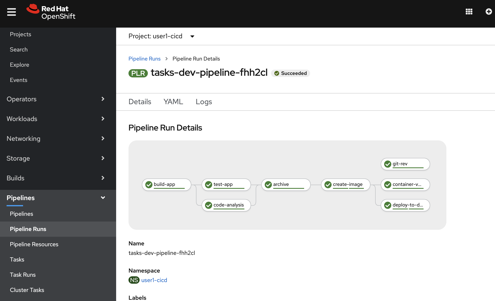

# Introduction

In this lab we will add Container Vulnerability Scanning through Clair


The workshop environment includes an instance of Red Hat Quay container registry.  In a browser, open the following URL `https://quay.%cluster_subdomain%` and log in with your username. 


Click on the `Create New Repository` button, name it `tekton-tasks` and choose it to be a private repository. 


# Local Development - Explore Quay
> **NOTE**
> The section below allows for exploration from a local workstation that has podman and skopeo installed. If you don't have these available, review the steps below and then proceed to the [Create Push-to-Quay task](#create-push-to-quay-task)

Now that we have a new repository, we can push and pull images from this repository.  

```bash

$oc tag tekton-tasks:latest tekton-tasks:quay1 -n %username%-dev

$ podman run -it --entrypoint /bin/bash quay.io/skopeo/stable

$ skopeo login default-route-openshift-image-registry.%cluster_subdomain%/%username%-dev/tekton-tasks

$ skopeo login https://quay.%cluster_subdomain%/repository/%username%/tekton-tasks --tls-verify=false

$ skopeo  copy docker://default-route-openshift-image-registry.%cluster_subdomain%/%username%-dev/tekton-tasks:latest docker://quay.%cluster_subdomain%/%username%/tekton-tasks:quay1 --src-tls-verify=false --dest-tls-verify=false

```

Now, if we navigate to the Quay repository for `tekton-tasks` we can see the vulnerabilities that have been found in the image. 


# Create Push-to-Quay task

Now that we are fairly confident in working with Tekton Tasks, let's use some of the niceties that we can lean on based on our experience so far. As before, the easiest path forward is to create a standalone TaskRun with the TaskSpec bundled in it in order to work out the details of the task. 

A few notable details below: 
* The container image for Skopeo is `quay.io/skopeo/stable`
* We will use the `pipeline` Service Account because that service account in the `%username%-cicd% project is already able to authenticate to both Quay and the internal image registry
* Instead of using the Route for the internal registry, we use the internal service URL - `image-registry.openshift-image-registry.svc.cluster.local:5000`
* Instead of using the Quay route, we use the internally accessible service at `quayecosystem-quay.quay-enterprise.svc.cluster.local:443`
* We include the `--debug` flag to show additional details in case the operation is failing


```yaml
apiVersion: tekton.dev/v1beta1
kind: TaskRun
metadata:
  generateName: skopeo-quay-copy-
spec:
  serviceAccountName: pipeline
  taskSpec:
    steps:
    - name: skopeo-copy
      args:
        - copy 
        - --debug
        - docker://image-registry.openshift-image-registry.svc.cluster.local:5000/%username%-dev/tekton-tasks:latest  
        - docker://quayecosystem-quay.quay-enterprise.svc.cluster.local:443/%username%/tekton-tasks:quay
        - --src-tls-verify=false 
        - --dest-tls-verify=false
      command:
        - /usr/bin/skopeo
      image: quay.io/skopeo/stable
```
Now, if we navigate to the [Quay Repository](https://quay.%cluster_subdomain%/repository/%username%/tekton-tasks) we can see the results of our new container image being stored and scanned. 


Once we see this TaskRun completing successfully, we can migrate the Task spec to a standalone task and parametrize it as needed. Below are the resources at hand. A few notable items:
* We could create explicit PipelineResources for the source and target images (in quay and the internal registry); however, we would need to create a new one for each Revision, which doesn't make a lot of sense.  


```yaml
apiVersion: tekton.dev/v1beta1
kind: Task
metadata:
  name: send-to-quay
spec:
  params:
  - description: >-
      Source (project/image:tagName) and image:rev to push, e.g.
      %username%-dev/tekton-tasks:latest
    name: source_image
    type: string
  - description: >-
      The target (user/repo:tagName) where to push in quay, e.g.
      %username%/tekton-tasks:quay1
    name: target_image
    type: string

  steps:
  - name: skopeo-copy
    args:
      - copy 
      - docker://image-registry.openshift-image-registry.svc.cluster.local:5000/$(params.source_image)
      - docker://quayecosystem-quay.quay-enterprise.svc.cluster.local:443/$(params.target_image)
      - --src-tls-verify=false 
      - --dest-tls-verify=false
    command:
      - /usr/bin/skopeo
    image: quay.io/skopeo/stable
```

With this Task, we can now test the task run:
```execute
tkn task start --param source_image=%username%-dev/tekton-tasks:latest --param target_image=%username%/tekton-tasks:quay2 send-to-quay --showlog
```

We can see the TasRun succeed - we're in business ! 


# Add Clair Container Scan to Pipeline

We can now update our Pipeline to include the `Clair Container Vulnerability Scan` step, right after the `create-image` stage.  Also, note that the `runAfter` attribute of the `deploy-to-dev` task needs to be updated to follow the `container-vulnerability-scan` task invocation. 

```yaml
apiVersion: tekton.dev/v1beta1
kind: Pipeline
metadata:
  name: tasks-dev-pipeline
spec:
  resources:
    - name: pipeline-source
      type: git

  workspaces:
    - name: local-maven-repo

  tasks:
    - name: build-app
      # ... snipped for brevity ... 
    - name: test-app
      # ... snipped for brevity .. 
    - name: code-analysis
      # ... snipped for brevity
    - name: archive
      # ... snipped for brevity
    - name: create-image
      # ... snipped for brevity
    - name: container-vulnerability-scan
      taskRef:
        kind: Task
        name: send-to-quay
      params:
          - name: source_image
            value: %username%-dev/tekton-tasks:$(tasks.git-rev.results.gitsha)
          - name: target_image
            value: %username%/tekton-tasks:$(tasks.git-rev.results.gitsha)
      runAfter:
          - create-image  
    - name: deploy-to-dev
      taskRef:
        # ... snipped for brevity
      runAfter:
          - container-vulnerability-scan
```

We can re-start the `tasks-dev-pipeline` pipeline and see it go through completion: 
```execute
tkn pipeline start --resource pipeline-source=tasks-source-code --workspace name=local-maven-repo,claimName=maven-repo-pvc tasks-dev-pipeline --showlog
```



If we navigate to Quay, we can also see the newly added tag (based on the gitrev) created in Quay


# Conclusion

In this lab we explored the features of Quay and its ability to run Container Vulnerability scans on images pushed into Quay. Then, we enhanced our pipeline to include a step to push our created image into Quay so that we can inspect the vulnerabilities in it, before a decision is made whether to send the application to the Stage environment