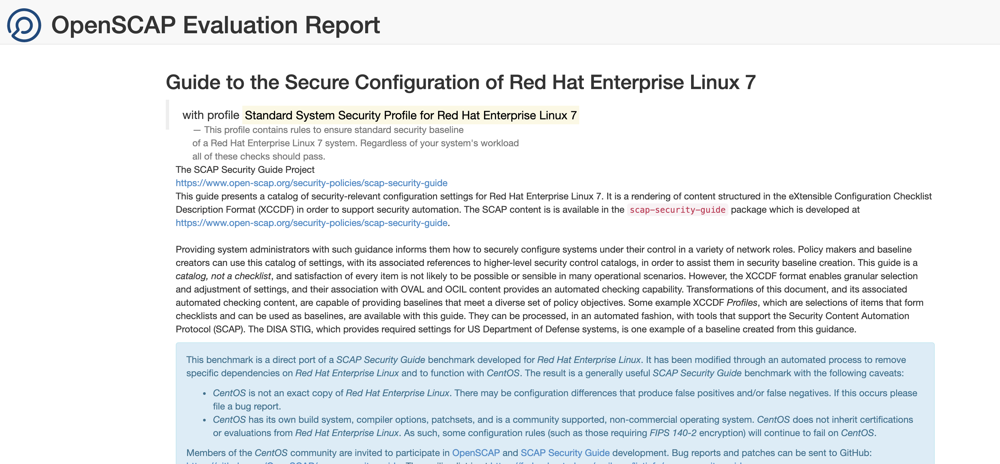

# Introduction

In this Lab, we will add an OpenSCAP Scan to your pipeline. 


So far, we've taken pause to consider the *stuff* that resides in our application image, but we haven't paid much attention to *what we're doing* with it. While Clair scans offer valuable information on image vulnerabilities, organizational constraints usually require application components to be configured to certain security standards in order to achieve **Authority to Operate (ATO)**. The **National Institute of Standards and Technology (NIST)** maintains one such standard, the **Security Content Automation Protocol (SCAP)**, which is widely recognized across government and industry as a specification that addresses most organizational concerns.

In our pipeline, we'll be using [OpenSCAP](https://www.open-scap.org/), a project that provides tools for implementing and enforcing the SCAP standard. Useful for our case will be the [SCAP Security Guide](https://www.open-scap.org/security-policies/scap-security-guide/), a tool which transforms SCAP security guidelines into machine-readable format, which OpenSCAP then compares against our application's container image. This process is effective for applying known security baselines such as DISA STIGs, the required settings for Department of Defense Systems.

# Create an OpenSCAP Task

Similar to other quality gates in our pipeline, this step will provide informational messages about violations in policy configurations, allowing organization administrators to assess whether an application image should be promoted to the Staging environment. Building a container *in* an OpenShift container requires a privileged context, which is difficult achieve in a workshop setting. In lieu of performing local development, let's consider what an OpenSCAP task might look like and walk through the steps we've taken:

```bash
apiVersion: tekton.dev/v1beta1
kind: Task
metadata:
  name: oscap-image-scan
  namespace: %username%-cicd
spec:
  steps:
  - name: scan-image
    securityContext:
      privileged: true
    image: quay.io/redhatgov/image-scanner:latest
    script: >
      #!/bin/sh

      buildah from --tls-verify=false --storage-driver vfs "docker://image-registry.openshift-image-registry.svc.cluster.local:5000/%username%-cicd/tasks:latest:latest" 

      CONTAINER_ID=$(buildah --storage-driver vfs containers -q)  

      MOUNT_POINT=$(buildah mount --storage-driver vfs $CONTAINER_ID | cut -d' ' -f2) 

      oscap-chroot "$MOUNT_POINT" xccdf eval --profile xccdf_org.ssgproject.content_profile_standard --report /tmp/report.html /usr/share/xml/scap/ssg/content/ssg-centos7-ds-1.2.xml

      curl -k --user 'deployment:deployment123' --upload-file /tmp/report.html https://nexus-devsecops.%cluster_subdomain%/repository/oscap-reports/test/%username%/report.html
EOF

```

The first thing to note is that we're leveraging `quay.io/redhatgov/image-scanner`, a container that has been pre-built with an installation `oscap-chroot`, a CLI for executing OpenSCAP scans against local filesystems.

Now, the filesystem we're interested in scanning is, of course, that of our application container. In order to mount that filesystem in our development pod, we're going to use [Buildah](https://buildah.io/), a tool used for building and manipulating container images. The cool thing about using **Buildah** for this purpose is that while building a `Dockerfile` is supported, it doesn't *require* one, nor does it require a **daemon** or **root privileges** (when run from a host). 

We use `buildah from` to create a **working container** from our application image. We store this container's ID in the `CONTAINER_ID` environment variable using `buildah containers`.

```bash
buildah from --authfile=/tmp/auth.json --tls-verify=false --storage-driver vfs "docker://image-registry.openshift-image-registry.svc.cluster.local:5000/%username%-cicd/tasks:latest"

CONTAINER_ID=$(buildah --storage-driver vfs containers -q)
```

Then we use `buildah mount` to mount the working container's filesystem into our task pod's filesystem. Here, we store the mount location to the `MOUNT_POINT` environment variable.

```bash
MOUNT_POINT=$(buildah --storage-driver vfs mount $CONTAINER_ID | cut -d' ' -f2)
```

And just like that, we're ready to run a scan with `oscap-chroot`. As you might imagine, there are a wide array of **standards** and **profiles** against which to evaluate. For the purpose of this workshop, we've selected an example specification for you. You can learn more about available baselines [here](https://csrc.nist.gov/Projects/Security-Content-Automation-Protocol/Specifications).

```bash
oscap-chroot "$MOUNT_POINT" xccdf eval --profile xccdf_org.ssgproject.content_profile_standard --report /tmp/report.html /usr/share/xml/scap/ssg/content/ssg-centos7-ds-1.2.xml
```

All that's left to do is present the scan result in a consumable format so that it can thoroughly evaluated by our system administrator. In addition to a summary streamed to `STDOUT`, `oscap-chroot` will populate a scan report for us in the `/tmp` directory thanks to the `--report "/tmp/report.html"` argument we pass to it. We'll publish this file to a [Raw Nexus Repository](https://help.sonatype.com/repomanager3/formats/raw-repositories) so that it can be viewed in a browser:

```bash
curl -k --user 'deployment:deployment123' --upload-file /tmp/report.html https://nexus-devsecops.%cluster_subdomain%/repository/oscap-reports/test/%username%/report.html
```

Now let's actually create this `Task`. We'll use some of the techniques we've learned throughout this workshop to make it reusable in case we need to change the parameters we provide to `oscap-chroot` at some point:

```execute
oc apply -n %username%-cicd -f - << EOF
apiVersion: tekton.dev/v1beta1
kind: Task
metadata:
  name: oscap-image-scan
spec:
  params:
  - name: xccdfProfile
    description: The oscap xccdf profile to use when calling the oscap-chroot command
    default: xccdf_org.ssgproject.content_profile_standard
  - name: oscapProfilePath
    description: The full path to the oscap content file
    default: /usr/share/xml/scap/ssg/content/ssg-centos7-ds-1.2.xml
  - name: container-imagetag
    type: string
    default: latest
  - name: container-image-url
    type: string
    default: >-
      image-registry.openshift-image-registry.svc.cluster.local:5000/%username%-cicd/tasks
  steps:
  - name: scan-image
    securityContext:
      privileged: true
    image: quay.io/redhatgov/image-scanner:latest
    script: >
      #!/bin/sh

      echo "Pulling image \$(params.container-image-url)" 

      buildah from --tls-verify=false --storage-driver vfs "docker://\$(params.container-image-url):\$(params.container-imagetag)" 

      container_id=\$(buildah --storage-driver vfs containers -q) 

      echo "Container ID: \$container_id" 

      echo "Mounting the container..." 

      mount_point=\$(buildah mount --storage-driver vfs \$container_id | cut -d' ' -f2) 

      echo "Running oscap-chroot scan" 

      oscap-chroot "\$mount_point" xccdf eval --profile "\$(params.xccdfProfile)" --report /tmp/report.html "\$(params.oscapProfilePath)"

      echo "Displaying contents of /tmp/report.html"

      echo "********** START OF report.html **********" 

      cat /tmp/report.html 

      echo "********** END OF report.html ************" 

      echo "Uploading report.html to https://nexus-devsecops.%cluster_subdomain%/repository/oscap-reports/test/%username%/report.html"

      curl -k --user 'deployment:deployment123' --upload-file /tmp/report.html https://nexus-devsecops.%cluster_subdomain%/repository/reports/%username%/report.html
EOF
```

Then let's execute this task and watch the output:

```execute
tkn task start --showlog \
    --param xccdfProfile=xccdf_org.ssgproject.content_profile_standard \
    --param oscapProfilePath=/usr/share/xml/scap/ssg/content/ssg-centos7-ds-1.2.xml \
    --param container-imagetag=latest \
    --param container-image-url=image-registry.openshift-image-registry.svc.cluster.local:5000/%username%-cicd/tasks \
    oscap-image-scan
```

Observe the scan results as different criteria in the specification are evaluated:

```bash
...
Title   Ensure /var/log Located On Separate Partition
Rule    xccdf_org.ssgproject.content_rule_partition_for_var_log
Result  notapplicable

Title   Ensure Software Patches Installed
Rule    xccdf_org.ssgproject.content_rule_security_patches_up_to_date
Result  notchecked

Title   Ensure gpgcheck Enabled In Main yum Configuration
Rule    xccdf_org.ssgproject.content_rule_ensure_gpgcheck_globally_activated
Result  pass

Title   Ensure Red Hat GPG Key Installed
Rule    xccdf_org.ssgproject.content_rule_ensure_redhat_gpgkey_installed
Result  fail
...
```

Double check to make we've done this correctly by visiting the report's home in [Nexus](https://nexus-devsecops.%cluster_subdomain%/repository/reports/%username%/report.html).


*Success!*

# Add the OpenSCAP Task to the Pipeline
Now we're ready to incorporate our final task into the pipeline. We'll run this in parallel with our vulnerability scan.

```execute
DEPLOY_TO_DEV=$(oc get pipelines tasks-dev-pipeline -o yaml | yq r --collect - 'spec.tasks[7]') && TASKS="$(oc get pipelines tasks-dev-pipeline -o yaml | yq r - 'spec.tasks' | yq d - '[7]')" && cat << EOF | yq p - 'spec.tasks' > patch.yaml
$TASKS
- name: oscap-image-scan
  taskRef:
    kind: Task
    name: oscap-image-scan
  params:
  - name: xccdfProfile
    value: xccdf_org.ssgproject.content_profile_standard
  - name: oscapProfilePath
    value: /usr/share/xml/scap/ssg/content/ssg-centos7-ds-1.2.xml
  - name: container-imagetag
    value: latest
  - name: container-image-url
    value: image-registry.openshift-image-registry.svc.cluster.local:5000/%username%-cicd/tasks
  runAfter:
  - create-image
$DEPLOY_TO_DEV
EOF
oc patch pipelines tasks-dev-pipeline --type=merge -p "$(cat patch.yaml)"
rm patch.yaml
```

Our pipeline is now complete! Let's kick it off one last time:
```execute
tkn pipeline start --resource pipeline-source=tasks-source-code --workspace name=local-maven-repo,claimName=maven-repo-pvc tasks-dev-pipeline --showlog
```

# Conclusion

In this lab, we explored the capabilities of OpenSCAP to help implement and enforce security configuration standards. Incorporating this step into our pipeline ensures that we're in a better position to gain ATO for our application.